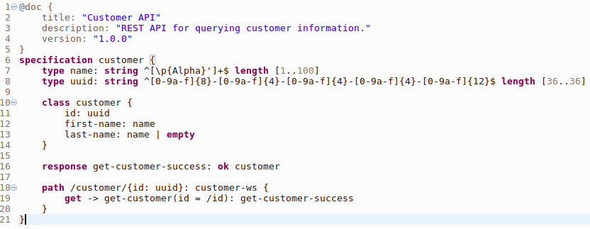

# Restrulz

A domain specific language for defining REST service specifications.

**Warning: this project is far from feature complete and is not ready for general use.**

# Screenshot

Below is a screenshot of a Restrulz specification being edited in Eclipse using
the Restrulz plugin.

# Goals

* To be the first choice language for writing new REST services
* Have concise but readable syntax
* Be easy to add IDE tooling, code completion etc.
* Be easy an easy model to generate code from
* Leverage syntax highlighting to improve readability
* Provide IDE context completion support
* Encourage/enforce best practice
    * Consistent use of naming conventions
    * Require input validation to protect against injection attacks and range
      overflows
    * Not null by default
    * Strings are not empty by default
    * Arrays and strings may be empty but not null
    * You may not specify a property as omitted, support for omitted is implied
      by null/empty
        * Compliant implementations will transform omitted into null/empty
    * Compliant implementations will transform blank strings to empty strings so
      the developer doesn't have to distinguish between the two
    * Encourage reuse rather than repetition
* Numeric types to be safe to use for storing currency
* To force you to declare the caching policy for each REST service
* Have an easy to use syntax to allow splitting common elements into separate
  files
* Generation of Swagger specifications (via.
  [Restrulz Generator](https://github.com/gantsign/restrulz-gen))

# Non-goals

* To be able to model all existing/possible services
* Exposing low level numeric types such as IEEE 754 double/floats
    * Decimal numbers will be defined with a minimum and maximum range,
      plus the number of significant digits or decimal places
    * The point is to have decimal numbers that are safe to use as currency
* XML support
    * There will be no support for distinguishing between elements and
      attributes

# Progress

- [x] specification declaration
- [x] specification root documentation
- [x] string types
- [x] integer types
- [ ] decimal types
- [x] boolean type (the boolean type is a builtin type that can be used without
      being defined)
- [ ] iso date types
- [ ] iso time types
- [ ] iso datetime types
- [ ] email address type (the email address type will be a builtin type that can
      be used without being defined)
- [ ] URL type (the URL type will be a builtin type that can be used without
      being defined)
- [ ] enum types
- [ ] wrapped custom types to indicate to the code generator to wrap the value
      as an object for static typing (doesn't affect the JSON encoding)
- [x] class types
- [ ] map types
- [ ] type documentation
- [x] simple type properties
- [x] class type properties
- [ ] map properties
- [x] array properties
- [x] empty string properties
- [x] null integer properties
- [ ] null decimal properties
- [ ] null date properties
- [ ] null time properties
- [ ] null datetime properties
- [ ] null email address properties
- [ ] null URL properties
- [x] null class properties
- [ ] property documentation
- [x] response declarations
- [x] success status codes
- [x] class response body
- [ ] map response body
- [x] array response body
- [ ] empty response body
- [ ] response headers
- [ ] caching policy
- [ ] language
- [ ] redirect support
- [x] error responses
- [ ] response documentation
- [x] root level path mapping
- [ ] path mapping documentation
- [x] path parameter support
- [ ] path parameter documentation
- [x] GET support
- [ ] HEAD support
- [x] PUT support
- [x] POST support
- [x] DELETE support
- [x] request handler declaration
- [ ] request handler documentation
- [x] request handler path parameters
- [ ] request handler query parameters
- [ ] request handler header parameters
- [x] request handler body parameter
- [ ] request handler parameter documentation
- [x] sub-path mapping

# Related projects

* [Restrulz Generator](https://github.com/gantsign/restrulz-gen) this project
  will transform a Restrulz specification into various output formats

* [Restrulz JVM](https://github.com/gantsign/restrulz-jvm) JVM libraries
  required by code generated for the JVM

* [Restrulz Demo](https://github.com/gantsign/restrulz-demo) see Restrulz in
  action

# License

This project is under the
[Apache 2 Licence](https://raw.githubusercontent.com/gantsign/restrulz/master/LICENSE).

# Author information

John Freeman

GantSign Ltd.
Company No. 06109112 (registered in England)
